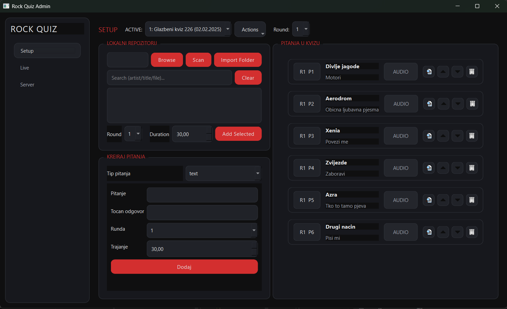
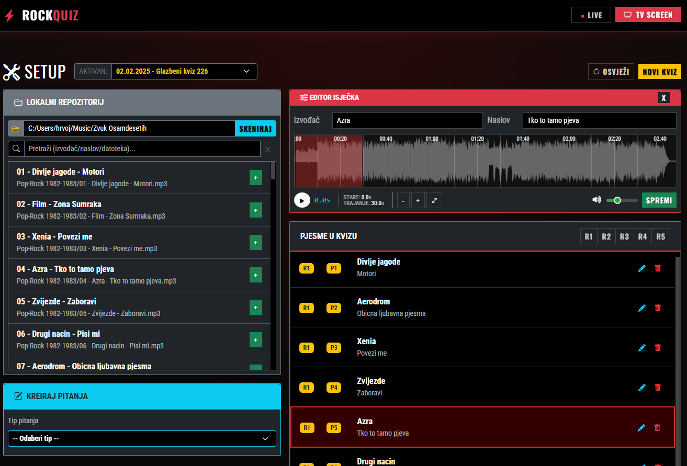
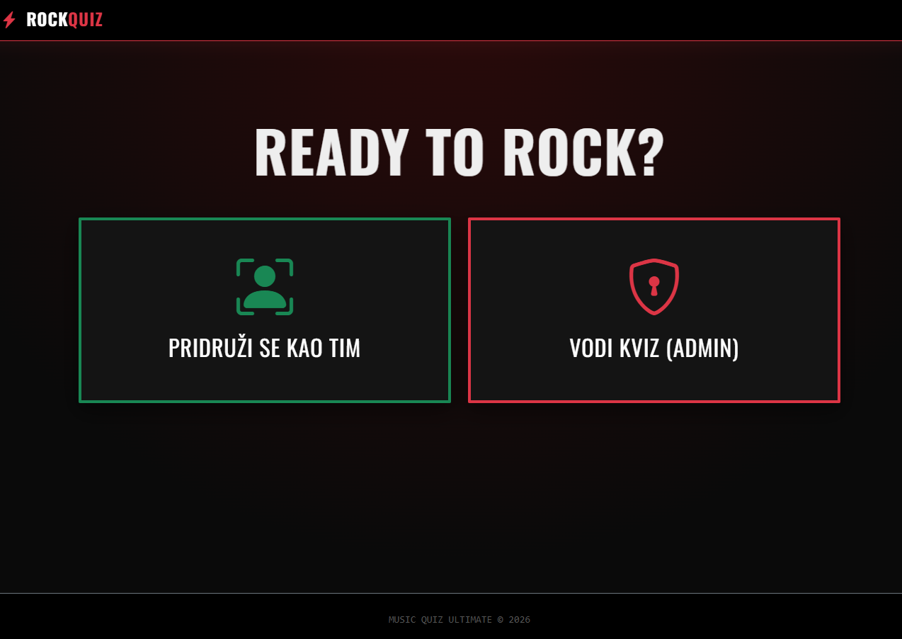

# Music Quiz Admin

Desktop admin launcher and web server for running a music quiz. The admin UI is built with PySide6, while the game runs as a Flask app with Socket.IO.

## Features
- Create and manage quizzes and questions
- Live control (players, grading, playlist)
- Audio preview with waveform and clip controls
- Local media import (songs/videos)

## Requirements
- Python 3.10+
- Windows (tested)

## Setup
```bash
pip install -r requirements.txt
```

## Run
Start the admin launcher:
```bash
python local_launcher.py
```

Start only the web server (optional):
```bash
python app.py
```

## Build Desktop App
```bash
python build_desktop.py
```

## Screenshots






## Usage Steps
1. Run the admin app: `python local_launcher.py`.
2. Create a new quiz (Actions -> New Quiz).
3. Import audio files (Local Repository -> Browse -> Scan -> Add Selected).
4. Create or edit questions as needed.
5. Start the game server from the Server tab.
6. Use the Live tab to monitor players and grade answers.

## Project Layout
- `local_launcher.py` - PySide6 admin app entry point
- `app.py` - Flask server
- `musicquiz/` - core app logic (models, services, routes)
- `admin_ui/` - PySide6 dialogs, widgets, styles
- `songs/` - local audio library (mp3)

## Notes
- The admin app starts/stops the game server from the UI.
- Media files are stored in `songs/` (audio) and `videos/` (created on first video import).
